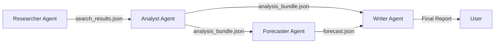

# System Architecture Overview

The Autonomous Workflow project is built on a **Pipeline-of-Agents** architecture. Agents are decoupled and communicate exclusively through structured JSON files.

## 🔄 Data Pipeline Flow

## 🧩 Modularity & decoupling

- **Statelessness**: Each agent is designed to be stateless. They take a JSON input and produce a JSON output. This means you can run the Analyst without running the Researcher (if you already have the data).
- **Format Consistency**: All internal communication uses the `AnalysisBundle` schema defined in `analyst_agent/src/schema.py`.
- **Parallel processing**: While the core pipeline is linear, the Researcher and Analyst agents are internally multithreaded (using standard Python libraries) to handle multiple articles/searches simultaneously.

## 📦 Core Technology Stack

- **Python 3.9+**: Core language.
- **Spacy / NLTK**: For Natural Language Processing.
- **Scikit-Learn**: For clustering and statistical modeling.
- **Jinja2**: For the template rendering engine.
- **DuckDuckGo API**: For web discovery.

## 💾 Output Directory Structure

- `data/raw/`: Storage for initial scrapings.
- `output/`: Storage for processed Analyst and Forecaster JSONs.
- `writer_agent/output/reports/`: Final readable results.
- `writer_agent/output/charts/`: Visual assets for the reports.
